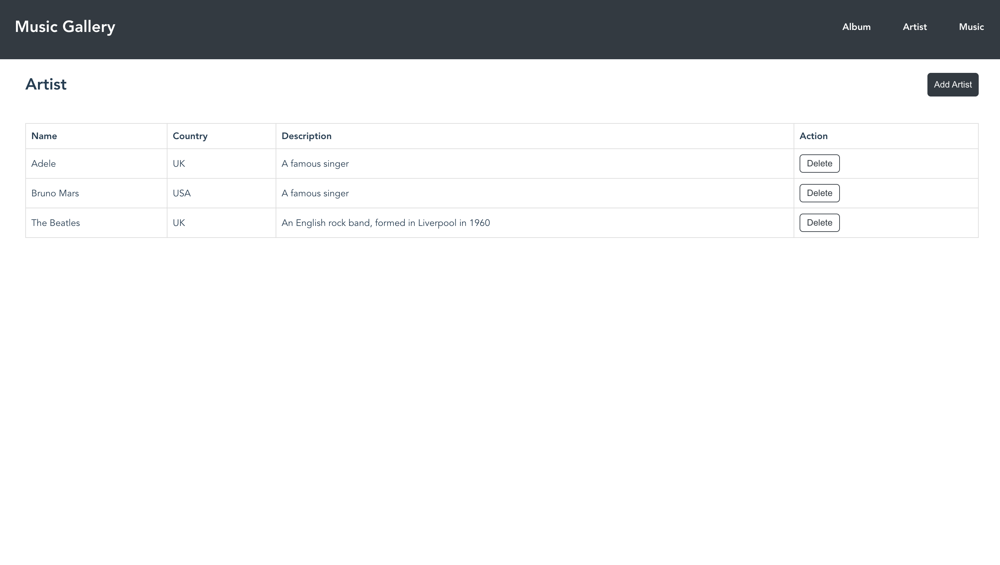

# The Music Gallery

The music gallery is a simple music library application built with Vue.js and Spring Boot. 
It allows users to add, edit, and delete albums and songs, as well as search and filter the library.

## Features
- Add, get, edit, and delete albums
- Add, get and delete artists
- Add, get, and delete songs within each album
- Search and filter the library by album title or venue

## Getting Started

To get started with the application, follow these steps:

1. Create database and table and load demo data if needed. Note: all sql files are located in /sql.

2. Go to /backend and run Application. Note: run with mvn command not recommended due to package version issue to be resolved.
If the backend is running, you will see a message when post the request below.

```
curl --location 'http://localhost:8086/test'
```

3. Go to /frontend and install the necessary dependencies using npm install.

4. Start the development server using npm run dev.

5. Access the application at http://localhost:9527 in your web browser.





## Data Model Design
The data model for our music library application includes the following entities:

Artist: Represents an artist in the music library. Each artist has a unique ID, a name, a country and a description.
Album: Represents an album in the music library. Each album has a unique ID, a name, an artist, a year of release, a collection of songs and so on.
Music: Represents a song in the music library. Each song has a unique ID, a name, an artist, an album, a duration and so on.
The relationships between these entities are as follows:

An artist has many albums, and each album belongs to one artist.
An album has many songs, and each song belongs to one album.
To implement this data model, I use a relational database with three tables: artist, album, and music.

## Service Design
Here is an overview of the service layer modules implemented in this application:

Music Service: Provides functionality for managing music, including adding and deleting music, as well as searching for music.
Artist Service: Provides functionality for managing artists, including adding, and deleting artists.
Album Service: Provides functionality for managing albums, including adding, editing, and deleting albums, as well as searching for albums.

To support new types of album, I implement a Digital Album Service and Live Album Service which inherit from the Album Service to handle different/new methods for new album types.


## Future Work
Some possible improvements to the application could include:

Adding authentication and authorization features to restrict access to certain parts of the application
Enhancing the UI with more interactive features, such as drag-and-drop functionality for reordering songs in an album
Optimizing the backend for better performance, such as caching frequently accessed data to reduce database queries

## License

[MIT © Lin Pang.](https://github.com/l-pang)